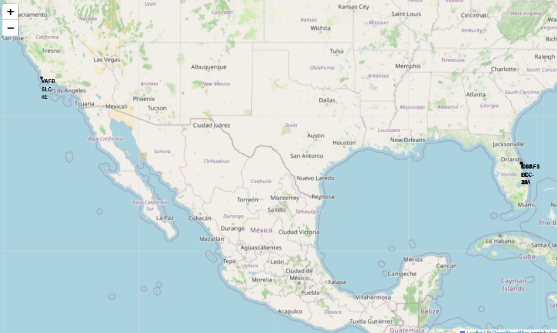
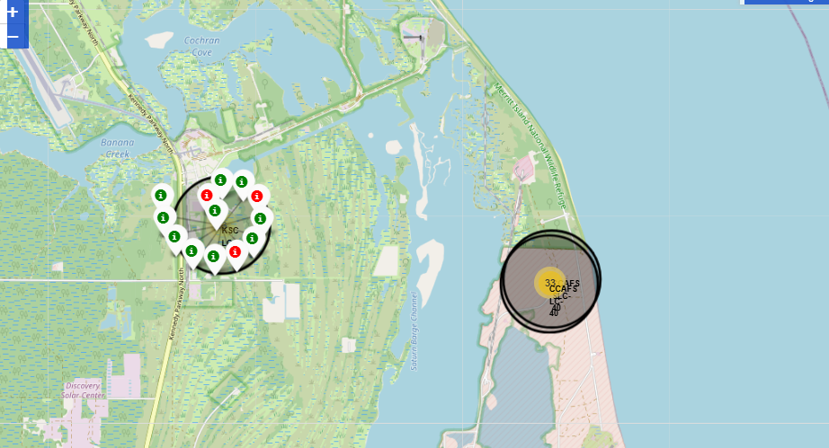
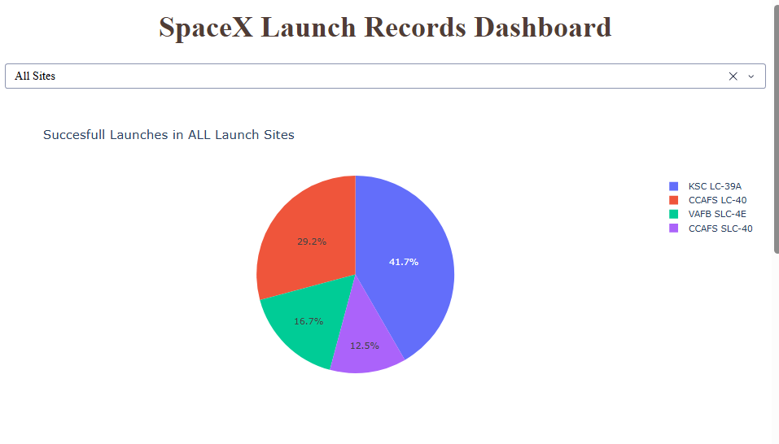
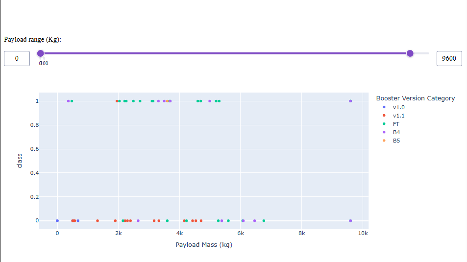

# Data-Science-Capstone
Repository containign different stages of the Data Science Captone from Coursera

The goal is to generate a capstone project to predict wether SpaceX will attempt to land a rocket and its outcome, this capstone must be a Data Science end-to-end project that includes content from all the courses of the Data Science IBM Profesional Certificate in Coursera
Its conformed by 8 Jupyter Notebooks each with its own Tasks and following the process from the previous one
The order is:

1.- Data Collection (CS_DataColl_API): Use the SpaceX REST API to get data about launches like launch specs, land specs, outcome, booster, etc.

2.- Data Web Scraping (CS_WebScrap): Use the wiki for web scraping regarding the use of BeautifulSoup to get HTML tables that also contain launch records and parse them into Pandas DataFrame

3.- Data Wrangling (CS_DataWran): After getting a cleaned dataframe we do EDA in order to get some valuable insights from each launch site, outcomes per eac type of mission and each type of landing. Also to create a label for each outcome

4.- Exploratory Data Analysis (CS_SQL_EDA): We contonue to do Exploratory Analysis but using SQL as the tool for managing the data, such as getting the exact name for each outcome, the payload carried for each type of booster, getting the average also, list dates of the first succesfull landing in a ground pad, and getting failure or success outcomes in given periods of time as a more comprehensive EDA

5.- Visuaization (CS_EDA_VIS): Use then the dataframe to visualize some relationships like payload per each flight, or launchsite, also measuring the orbit and its success rate and in the final steps to see the increase of success rate year by year along with feature engineering for next steps 

6.- Visual Analytics with Folium (CS_Folium): Generate maps for data analysis with different components, like markers in each launchsite, markerclusters to measure the success/failure rate in launches and some spatial measurements like the distance between a coastline and a launchsite, due to GitHub not showing Folium components here are some examples of what were somo of the resulting maps in this notebook

  

  

(For more images of this notebook´s results go to /images in this repo and see the one under the name 'FOLIUM_X') 

7.- Visual Analytics with Dash (CS_Dash): For this notebook the task is to generate a Dashboard using dash and Graph Objects components along with Express(xp) to see in a pie chart and scatter plot the change between launch sites for the sucess rate and the type of booster with its outcome given a payload mass, all done with a callback decorator for the user to input various parameters like the payload mass, the launch site or all launchsites for the analysis and see the Dash App updating the info, given the fact that Github does not show dash apps here are some results of the notebook

  

  

(For more images of this notebook´s results go to /images in this repo and see the one under the name 'DASH  _X')

8.- Machine Learnign Predictions (CS_ML_Predict): This notebook is one of the most important steps, here is the actual implementation of 4 different Machine Learning algorithms to compare between each other, the goal is to predict the outcome of future launches and select which is the best algorithm for prediction comparing scores, to compare them the data was put into the test_train_split process to avoid data leakage, and firt train the data for each ML method, and then see its result on the test data, the 4 methos compares were a SVM (Support Vector Machine), KNN (K Nearest Neighbors), Logstic Regression and a Decision Tree, for the notebook the confusion matrix for each methos was obtaines in order to have a visual resource to see the results for each ML Method.
